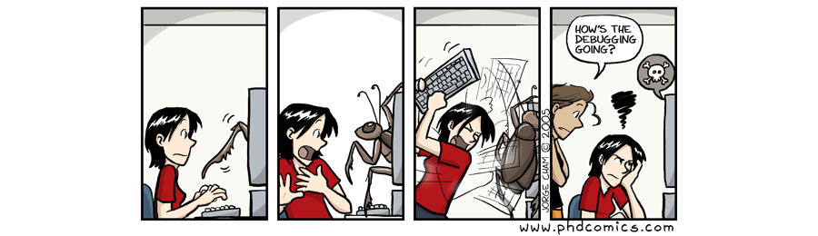

# Scientific Python course

Lecture notes from the course taught at the [University of Bordeaux] in the
academic year 2018 for PhD students.  Each student needs to come with a
notebook computer running either Linux, OSX or Windows.  

 Adapted from https://xkcd.com/353/

The scientific Python ecosystem is made of several modules that constitute
together the scientific stack. There are hundreds of [Python scientific
packages] and most of them are built on top of numpy, scipy, matplotib, pandas,
cython and/or sympy. We won't cover everything in this short course, but you
should get enough information to decide if your research can benefit from
Python. And I bet it will likely do.

This course is based on the following teaching material:

* [Software Carpentry] ([CC BY 4.0])
* [Matplotlib tutorial] ([CC BY 4.0])
* [Scipy Lecture Notes] ([CC BY 4.0])
* [From Python to Numpy] ([CC BY-NC-SA 4.0])

## 1. Beginner course (day 1 & 2)

### 1.1 - Introduction (day 1)

This [gentle introduction to Python](introduction.md) explains how to install
Python and introduces some very simple concepts related to numerical
expressions and other data types.

**See also**:

 * [The Python Tutorial](https://docs.python.org/3/tutorial/)

### 1.2 - Programming with Python (day 1)

This [lecture](http://www.scipy-lectures.org/intro/language/python_language.html)
does not attempt to be comprehensive and cover every single feature, or even
every commonly used feature. Instead, it introduces many of Python's most
noteworthy features, and will give you a good idea of the language’s flavor and
style.

**See also**:

 * [Dive into Python](http://www.diveintopython3.net)

### 1.3 - Computation I (day 2)

The primary goal of this
[lesson](http://www.scipy-lectures.org/intro/numpy/index.html) is to introduce
the numpy (numerical python) module which is de facto the standard module for
numerical computing with Python. It is essential for you to become familiar
with this module since it will be used everywhere in the next lessons.

**See also**:

  * [Numpy tutorial](https://github.com/rougier/numpy-tutorial)
  * [100 Numpy exercises](https://github.com/rougier/numpy-100)
  * [Numpy MedKit](http://mentat.za.net/numpy/numpy_advanced_slides/)

### 1.4 - Visualization (day 2)

This [tutorial](https://github.com/rougier/matplotlib-tutorial) gives an
overview of Matplotlib, the core tool for 2D & 2.5D plotting that produces
publication quality figures as well as interactive environments across
platforms.

**See also**:

  * [Visualization Crash Course](https://github.com/rougier/ASPP-2017)
  * [10 Simple rules for better figures](http://journals.plos.org/ploscompbiol/article?id=10.1371/journal.pcbi.1003833)
  * [Pyplot tutorial](http://matplotlib.org/users/pyplot_tutorial.html)
  

----

## 2. Advanced course  (day 3 & 4)

### 2.1 - Scientific computation II (day 3)

This [lesson](http://www.scipy-lectures.org/intro/scipy.html) introduces the
scipy package that contains various toolboxes dedicated to common issues in
scientific computing. Its different submodules correspond to different
applications, such as interpolation, integration, optimization, image
processing, statistics, special functions, etc.

**See also**:

  * [Scipy Tutorial](http://docs.scipy.org/doc/scipy/reference/tutorial/)
  * [Numerical Analysis: Python vs Matlab](http://hyperpolyglot.org/numerical-analysis)

### 2.2 - Version control (day 3)

This lesson introduces [version control using
git](https://swcarpentry.github.io/git-novice/). Version control is the lab
notebook of the digital world: it's what professionals use to keep track of
what they’ve done and to collaborate with other people. And it isn't just for
software: books, papers, small data sets, and anything that changes over time
or needs to be shared can and should be stored in a version control system.

**See also**:

  * [Git Book](https://git-scm.com/book/en/v2)
  * [Git cheat sheet](https://www.git-tower.com/blog/git-cheat-sheet/)
  * [Oh shit, git!](http://ohshitgit.com)

### 2.3 - C/Python integration (day 4)

This
[chapter](http://www.scipy-lectures.org/advanced/interfacing_with_c/interfacing_with_c.html)
covers the many different routes for making your native code (primarily C/C++)
available from Python, a process commonly referred to wrapping. The goal of
this chapter is to give you a flavour of what technologies exist and what their
respective merits and shortcomings are, so that you can select the appropriate
one for your specific needs.

### 2.4 - Vectorization (day 4)

[NumPy is all about
vectorization](http://www.labri.fr/perso/nrougier/from-python-to-numpy/). If
you are familiar with Python, this is the main difficulty you'll face because
you'll need to change your way of thinking and your new friends (among others)
are named "vectors", "arrays", "views" or "ufuncs".

----

<!----------------------------- External links ------------------------------->
[Python]:     http://www.python.org
[Numpy]:      http://www.numpy.org
[Scipy]:      http://www.scipy.org
[Pandas]:     http://pandas.pydata.org
[Matplotlib]: http://matplotlib.org
[IPython]:    http://ipython.org
[Jupyter]:    http://jupyter.org
[Git]:        https://git-scm.com
[OpenGL]:     https://www.opengl.org
[Glumpy]:     https://glumpy.github.io
[Bokeh]:      https://bokeh.org
[Cython]:     http://cython.org
[Software Carpentry]:  http://software-carpentry.org
[Scipy Lecture Notes]: http://www.scipy-lectures.org
[Matplotlib tutorial]:
      http://www.labri.fr/perso/nrougier/teaching/matplotlib/matplotlib.html
[From Python to Numpy]: http://www.labri.fr/perso/nrougier/from-python-to-numpy/
[University of Bordeaux]: http://www.u-bordeaux.com
[Python scientific packages]: (https://pypi.python.org/pypi?:action=browse&c=385)
[CC BY 4.0]: https://creativecommons.org/licenses/by/4.0/
[CC BY-NC-SA 4.0]: https://creativecommons.org/licenses/by-nc-sa/4.0/
<!---------------------------------------------------------------------------->
